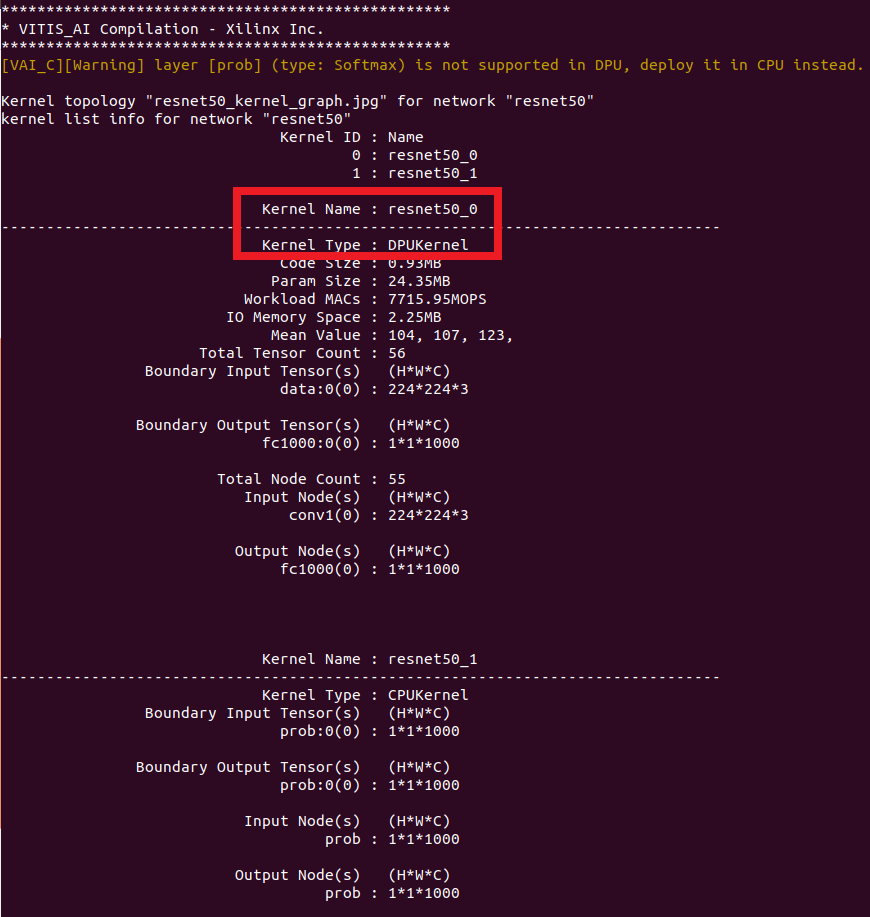

# DPU on PYNQ v2.5 Ultra96v2 Image

This repository helps users make their own DPU design work with PYNQ 
image v2.5. To do that, we need to first upgrade PYNQ v2.5 image to be 
compatible with Vitis AI 1.0. Then we will introduce the steps to rebuild
the hardware design. Finally we will cover steps to run DPU applications
on the Ultra96 v2 board.

## Prerequisite

We have the following assumptions:

1. As a starting point, we assume you have flashed your SD card with 
[Ultra96v2 image v2.5](http://avnet.me/ultra96v2-pynq-image-v2.5). 
2. You can boot up the board without any issue. It is 
recommended for you to use bigger power bricks; for example, I am using a 
[4A power brick](https://www.avnet.com/shop/us/products/avid-technologies/90152-2208-3074457345635740760/).
3. You have an Internet connection from the board. If you have a [USB-Ethernet
dongle](https://www.amazon.com/AmazonBasics-1000-Gigabit-Ethernet-Adapter/dp/B00M77HMU0), 
connect that to the USB port of Ultra96, that will give you a stable 
wired connection.
4. Your host machine should have Vitis 2019.2 and XRT 2019.2 installed.

To make sure the image is correct (image v2.5), run the following on the board:

```
cat /home/xilinx/REVISION
```

This should show:

```
cat REVISION
Release 2019_10_12 3f63450
Board 2019_10_12 cce6a6c https://github.com/Avnet/Ultra96-PYNQ.git
```

## Step 1: Upgrade PYNQ Image on Ultra96v2

The first step is to upgrade your image so we can install some libraries 
required by Vitis AI. 

**On your Ultra96 board**, run `su` to use super
user. Password is `xilinx`. Copy the `ultra96` folder over to your board. 
Go to the `ultra96` folder, and run:

```
chmod 777 upgrade.sh
chmod 777 */install.sh
./upgrade.sh
```

The upgrade process can take up to 4 hours so please be patient. 
At the same time, you can proceed to the next few steps.

By default, the `upgrade.sh` script will install / update the following packages:

* `pynq`: Install `pynq` 2.5.1 from source distribution.
* `xrt`: Xilinx Run Time (XRT) will be upgraded to tag `2019.2_RC2`.
* `ubuntu_pkg`: Install `devmem2` and `at-spi2-core` from Ubuntu repository; remove the old `opencv` package.
* `opencv`: Build and install `opencv` 3.4.3 from source, which takes around 60 mins.
* `protobuf`: Build and install `protobuf` 3.6.1 from source, which takes around 60 mins.
* `jsonc`: Build and install `json-c` 0.13.1 from source, which takes around 10 mins.
* `dpu_clk`: Install a small Python script to control DPU clocks.
* `dnndk`: Download and install DNNDK run time library for DPU.

Users can also disable any of them by setting the option to 0.
For example:

```
./upgrade.sh pynq=0
```

## Step 2 (Optional): Build Hardware Design on Host

While your board is being upgraded, we can take a look at the hardware design.

**On your host machine**, copy the `host` folder over to your host. 
Source proper Vitis 2019.2 settings. Go to the `host` folder, and run

```bash
chmod u+x build.sh
./build.sh
```

The above step can take up to 2 hours. Please be patient.
The `build.sh` does the following things:

* Build a bare minimum Vitis platform `dpu`.
* Build the DPU design based on [Vitis AI TRD](https://github.com/Xilinx/Vitis-AI/tree/v1.0/DPU-TRD/prj/Vitis) 
and the Vitis platform `dpu`.
* Copy overlay files (`dpu.hwh`, `dpu.bit`, and `dpu.xclbin`) out.

The released [Vitis AI TRD](https://github.com/Xilinx/Vitis-AI/tree/v1.0/DPU-TRD/prj/Vitis)
is good for ZCU102 and ZCU104. You can check what we have changed in `build.sh`
for Ultra96 so that the DPU IP can be successfully implemented on our 
Vitis platform. In general, Ultra96 has a smaller PL, so we can only target 
smaller DPU's on this platform.

After the building process is done, you should see some messages indicating the 
building is successful. 3 overlay files will be copied to the folder
[dpu_overlay](./host/dpu_overlay): `dpu.hwh`, `dpu.bit`, and `dpu.xclbin`.
Now you have the DPU overlay files which can work with PYNQ! 
Keep those 3 files in good hands.

**Note**: As long as we have those 3 files, we are done; please do NOT
replace PYNQ SD card content!

## Step 3: Build DPU Models on Host

**On your host machine**, go to your `host` folder. If you have already run
the `build.sh` in the previous step, you should be able to see (1) a Vitis AI 
Github repository has been cloned here, and (2) the `dpu.hwh` file has been
generated under `dpu_overlay` folder. 

If you have not installed docker on your host machine, please refer to the
[Vitis AI getting started page](https://github.com/Xilinx/Vitis-AI/tree/v1.0#Getting-Started)
to install docker. If you have docker already installed, we can run the
following commands now.

```
cp -rf Vitis-AI/docker_run.sh .
chmod u+x docker_run.sh
./docker_run.sh xilinx/vitis-ai:tools-1.0.0-cpu
```

The `docker_run.sh` will download a Vitis AI docker image. 
It may take a long time since the image is about 8GB. After the download is
complete, the `docker_run.sh` script will help you log onto that docker image.

The Vitis AI docker image gives users access to the Vitis AI utilities 
and compilation tools. If you have run `docker_run.sh` before, it will simply 
launch the docker image without downloading again. Once you are in the 
docker environment, you can run the `compile.sh` script that we provided.

```
./compile.sh
```

Users can also check this `compile.sh` and make some adjustments based on their
needs. In summary, this script does the following things:

* Adding Ultra96 support: we prepared the `Ultra96.dcf` and `Ultra96.json` 
files using the `dpu.hwh` file.
* Downloading a model from model zoo: as an example, we download the 
`resnet50` model for image classification.
* Compiling the model: we compile the model into a `*.elf` file.

If everything is successful, you should see a screen as shown below.



A new model file `dpu_resnet50_0.elf` should appear in your local working 
directory; you can deploy this file on the Ultra96 board later.
After you are done with the docker environment, type in:

```
exit
```

to exit.

For more information such as training your own model, please refer to the 
[Vitis AI user guide](https://www.xilinx.com/support/documentation/sw_manuals/vitis_ai/1_0/ug1414-vitis-ai.pdf)
and [Vitis AI Tutorials](https://github.com/xilinx/vitis-ai-tutorials).

## Step 4: Run Application on Ultra96v2

**On your Ultra96 board**, go to your jupyter notebook root folder, and run

```bash
cd /home/xilinx/jupyter_notebooks
mkdir pynq-dpu
```

Put the following files in this `pynq-dpu` folder:

1. The overlay files in [dpu_overlay](./host/dpu_overlay)(`dpu.bit`, `dpu.hwh`, `dpu.xclbin`).
2. The Python file in [app](./host/app)(`dpu.py`).
3. Any DPU model that you have compiled in Step 3 (e.g. `dpu_resnet50_0.elf`).

After that, you can create a new Jupyter notebook file in the same folder; 
add and run the following code:

```python
from dpu import DpuOverlay
overlay = DpuOverlay("dpu.bit")
```

And check the DPU information in a Jupyter notebook cell.

```python
!dexplorer -w
```

If you have compiled the `dpu_resnet50_0.elf` as introduced in Step 3, 
you can load it now:

```python
overlay.load_model("dpu_resnet50_0.elf")
```

Then you should be able to play with a couple of applications! 
For example, you can try to rebuild and run the [resnet50 application](https://github.com/Xilinx/Vitis-AI/tree/v1.0/DPU-TRD/app/Vitis/samples/resnet50)
on Vitis AI Github. The basic steps are:

1. Adjust the `KRENEL_CONV` in the [source file]( https://github.com/Xilinx/Vitis-AI/blob/v1.0/DPU-TRD/app/Vitis/samples/resnet50/src/main.cc#L74)
to `resnet50_0`; this is consistent with what is shown as `DPUKernel` in the 
screenshot above.
2. In terminal, run `make` to rebuild the [resnet50 application](https://github.com/Xilinx/Vitis-AI/tree/v1.0/DPU-TRD/app/Vitis/samples/resnet50).
3. In terminal, run the executable to classify a specific image (e.g., 
`./resnet50 img/bellpeppe-994958.JPEG`).

There are other applications and models that you can explore in the 
[Vitis AI Github](https://github.com/Xilinx/Vitis-AI).

## References

In this article we introduced the steps to make DPU design work on PYNQ image.
Due to some legal reasons, we are not able to release a complete image at this
moment. But the above steps should be able to help you. We list some of the 
useful references:

* [Vitis AI Github](https://github.com/Xilinx/Vitis-AI)
* [Vitis AI User Guide](https://www.xilinx.com/support/documentation/sw_manuals/vitis_ai/1_0/ug1414-vitis-ai.pdf)
* [Vitis AI TRD](https://github.com/Xilinx/Vitis-AI/tree/v1.0/DPU-TRD/prj/Vitis)
* [Vitis AI Model Zoo](https://github.com/Xilinx/AI-Model-Zoo/tree/v1.0)
* [Vitis Embedded Platform Source](https://github.com/Xilinx/Vitis_Embedded_Platform_Source)
